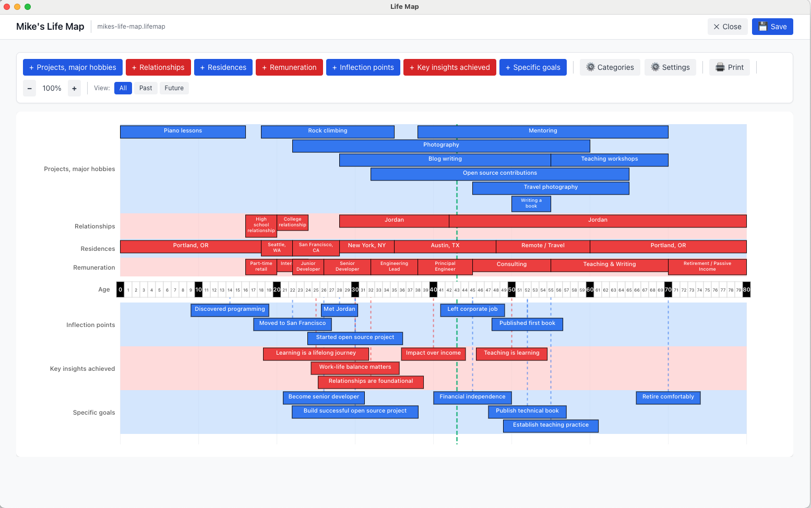

# Life Map

A cross-platform desktop application for creating and visualizing life timelines.



## About

Life Map helps you visualize your life journey by creating interactive timelines that map out key events, milestones, relationships, and goals across your lifetime. Whether you're reflecting on your past, planning your future, or sharing your story, Life Map provides an intuitive way to see the big picture of your life.

## Features

- **Interactive Timeline Visualization** - See your entire life at a glance with a clean, organized timeline
- **Customizable Categories** - Organize events by projects, relationships, residences, career, insights, and goals
- **Flexible Date System** - Use date of birth for automatic age calculation, or work with ages directly
- **Dynamic Age Ranges** - Timeline items can automatically extend to your maximum age as you update your life map
- **Color Coding** - Visual differentiation with blue and red color schemes
- **Zoom Controls** - Adjust the timeline scale for better visibility
- **View Modes** - Filter between All Events, Past Events, or Future Events
- **Category Management** - Add, edit, reorder, and customize categories to fit your needs
- **Print & Export** - Print your life map with customizable PDF generation
- **Local Storage** - All your data stays on your computer in simple `.lifemap` JSON files
- **Cross-Platform** - Currently available for macOS (Windows and Linux support planned)

## Installation

### macOS (Currently Supported)

**Download:** Get the latest `.dmg` file from the [Releases page](https://github.com/tbz43353/life-map-app/releases)

**Installation Steps:**

1. Download `Life Map-1.0.0.dmg`
2. Open the downloaded DMG file
3. Drag **Life Map** to your **Applications** folder
4. **Important**: On first launch, right-click the app and select "Open" to bypass Gatekeeper
   - This is required because the app is not yet code-signed
   - You only need to do this once
   - Alternative: Go to System Settings → Privacy & Security → Allow "Life Map"

**Compatibility:**
- ✅ macOS 11 (Big Sur) or later
- ✅ Intel and Apple Silicon (M1/M2/M3) Macs

### Windows & Linux

**Status:** Windows and Linux installers are not yet available but are planned for future releases.

**Want to help?** If you'd like to test Windows or Linux builds, please open an issue on GitHub!

## Building from Source

### Prerequisites

- [Node.js](https://nodejs.org/) (v18 or later)
- npm (comes with Node.js)
- Git

### Build Steps

1. Clone the repository:
```bash
git clone https://github.com/tbz43353/life-map-app.git
cd life-map-app
```

2. Install dependencies:
```bash
npm install
```

3. Run in development mode:
```bash
npm run electron:dev
```

4. Build installers for your platform:
```bash
# macOS
npm run electron:pack:mac

# Windows
npm run electron:pack:win

# Linux
npm run electron:pack:linux

# All platforms (requires platform-specific tooling)
npm run electron:pack:all
```

Installers will be created in the `release/` directory.

## Usage

### Creating Your Life Map

1. **Launch Life Map** - The app starts with a default template
2. **Set Your Date of Birth** - Click the settings icon to configure your birth date and maximum age
3. **Add Events** - Click on any category row to add timeline items
4. **Edit Items** - Click existing items to edit their details
5. **Use the "Max" Checkbox** - For ongoing items (current job, relationship, etc.), check "Max" to have them automatically extend to your life map's maximum age
6. **Save Your Work** - Use File → Save or Cmd/Ctrl+S to save your life map
7. **Print or Export** - Use File → Print to generate a PDF of your timeline

### File Format

Life maps are saved as `.lifemap` files, which are human-readable JSON files containing:
- Title and metadata
- Date of birth and age range
- Custom categories
- Timeline items with titles, descriptions, age ranges, and colors

You can safely back up, share, or version control these files.

### Sample Data

A sample life map (`samples/mikes-life-map.lifemap`) is included to demonstrate the app's capabilities.

## Technology Stack

- **Electron** - Cross-platform desktop framework
- **React** - UI framework
- **TypeScript** - Type-safe JavaScript
- **Vite** - Build tool and dev server
- **Tailwind CSS** - Utility-first CSS framework
- **electron-builder** - Application packaging

## Support This Project

If you find Life Map useful, please consider supporting its development:

- ⭐ **Star this repository** - Helps others discover the project
- 💖 **[GitHub Sponsors](https://github.com/sponsors/tbz43353)** - Monthly or one-time sponsorship
- ☕ **[Ko-fi](https://ko-fi.com/tonybiz)** - Buy me a coffee

Your support helps me dedicate more time to adding features, fixing bugs, and maintaining this project. Thank you! 🙏

## Contributing

Contributions are welcome! Please read [CONTRIBUTING.md](CONTRIBUTING.md) for guidelines on:

- Reporting bugs
- Suggesting features
- Submitting pull requests
- Code style and conventions

## Security

For security concerns or to report vulnerabilities, please see [SECURITY.md](SECURITY.md).

## Privacy

Life Map stores all your data locally on your computer. No information is sent to external servers or cloud services. Your life maps remain completely private and under your control.

## Changelog

See [CHANGELOG.md](CHANGELOG.md) for version history and release notes.

## License

This project is licensed under the MIT License - see the [LICENSE](LICENSE) file for details.

## Author

Created by **Tony Biz**

## Acknowledgments

- Inspired by [Gena Gorlin's substack post](https://substack.com/home/post/p-177498257) on life mapping and planning
- Built with amazing open source technologies
- Sample data is fictional and for demonstration purposes only

---

**Questions or Issues?** Open an issue on [GitHub](https://github.com/tbz43353/life-map-app/issues)
